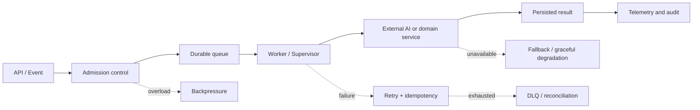

<svg width="880" height="180" viewBox="0 0 880 180" xmlns="http://www.w3.org/2000/svg" role="img" aria-labelledby="title description">
  <title id="title">Ankit Panicker — Engineering Depth Map</title>
  <desc id="description">An animated signal moves through architecture, AI orchestration, reliability, and production operations.</desc>
  <defs>
    <linearGradient id="signal" x1="0" y1="0" x2="1" y2="0">
      <stop offset="0" stop-color="#2563EB"/>
      <stop offset="0.52" stop-color="#06B6D4"/>
      <stop offset="1" stop-color="#14B8A6"/>
    </linearGradient>
    <filter id="glow" x="-30%" y="-30%" width="160%" height="160%">
      <feGaussianBlur stdDeviation="4" result="blur"/>
      <feMerge><feMergeNode in="blur"/><feMergeNode in="SourceGraphic"/></feMerge>
    </filter>
  </defs>
  <rect width="880" height="180" rx="18" fill="#07111F"/>
  <path d="M54 125 H826" stroke="#23344D" stroke-width="2"/>
  <path d="M54 125 H826" stroke="url(#signal)" stroke-width="3" stroke-dasharray="130 642">
    <animate attributeName="stroke-dashoffset" from="772" to="-772" dur="4.8s" repeatCount="indefinite"/>
  </path>
  <circle cx="54" cy="125" r="5" fill="#2563EB"/>
  <circle cx="311" cy="125" r="5" fill="#06B6D4"/>
  <circle cx="568" cy="125" r="5" fill="#14B8A6"/>
  <circle cx="826" cy="125" r="5" fill="#22C55E"/>
  <circle r="5" fill="#E6FBFF" filter="url(#glow)">
    <animateMotion dur="4.8s" repeatCount="indefinite" path="M54 125 H826"/>
  </circle>
  <text x="54" y="48" fill="#F8FAFC" font-size="28" font-family="Inter, Segoe UI, sans-serif" font-weight="700">ANKIT PANICKER</text>
  <text x="54" y="78" fill="#9FB3CC" font-size="16" font-family="Inter, Segoe UI, sans-serif">AI Systems Architecture · Platform Engineering · Reliability</text>
  <text x="54" y="151" fill="#7EA3D8" font-size="12" font-family="Inter, Segoe UI, sans-serif">ARCHITECTURE</text>
  <text x="272" y="151" fill="#64CFE3" font-size="12" font-family="Inter, Segoe UI, sans-serif">ORCHESTRATION</text>
  <text x="537" y="151" fill="#58D6C6" font-size="12" font-family="Inter, Segoe UI, sans-serif">RELIABILITY</text>
  <text x="773" y="151" fill="#71DF91" font-size="12" font-family="Inter, Segoe UI, sans-serif">OPS</text>
</svg>

# Engineering Depth & Technology Portfolio

**Architecture → implementation → tests → containers → deployment → operations**

> I build complete AI-enabled platforms around the model: APIs, distributed
> execution, tenant boundaries, recovery, evaluation, observability, deployment,
> and operational controls. My strongest work is in real-time AI infrastructure
> and reliability engineering—not foundation-model training.

---

## Navigate

- [Depth map](#depth-map)
- [Architecture and systems knowledge](#architecture--systems-knowledge)
- [Technology landscape](#technology-landscape)
- [Project stack dossiers](#project-stack-dossiers)
- [Engineering practices](#engineering-practices)
- [Knowledge boundaries](#knowledge-boundaries)
- [Compact professional stack](#compact-professional-stack)

---

## Depth map

Depth is based on repeated implementation evidence across the repositories in
`E:\Projects`, not on dependency presence alone.

| Depth | Meaning | Technologies and capabilities |
|---|---|---|
| **Deep** | Repeated implementation; defensible in a code walkthrough | Python, FastAPI, Redis primitives, asynchronous APIs, queue/worker systems, reliability engineering, multi-tenant backends, real-time AI orchestration |
| **Strong** | Used in working systems with meaningful ownership | TypeScript, React, Node.js/Express, PostgreSQL, MySQL, Docker/Compose, WebSockets, observability, testing, CI/CD |
| **Working** | Shipped or configured; not positioned as specialist depth | Go, Kubernetes/AKS, Terraform, Azure infrastructure, Cloudflare edge, Nginx, GPU inference operations, advanced browser/media APIs |
| **Exposure** | Integrated, evaluated, or present in a project; depth varies | Model families, PEFT/GGUF tooling, specialized vision/audio libraries, deep cluster internals, provider-specific advanced operations |

### Strongest engineering signature

- Failure paths are designed explicitly rather than treated as exceptional.
- Redis is used as a distributed primitive, not merely as a cache.
- At-least-once delivery is paired with idempotency and recovery controls.
- AI providers are placed behind routing, concurrency, timeout, and fallback
  boundaries.
- Runtime claims are kept separate from design intent and checked-in code.

---

## Architecture & systems knowledge

### Distributed execution

- Queue and worker separation
- Supervisor-controlled job state
- At-least-once processing semantics
- Idempotency keys and deduplication
- Dead-letter queues and reconciliation
- Exponential-backoff retries
- Write-ahead logs and replay
- Durable and transactional outboxes
- Optimistic concurrency
- Bounded concurrency and admission control
- Adaptive backpressure
- Graceful shutdown with in-flight draining
- Circuit breakers, including cross-process synchronization
- Partial-result and provider degradation strategies

### SaaS and platform architecture

- Multi-tenant data and execution boundaries
- Per-tenant capacity controls
- RBAC and role-to-module authorization
- White-label configuration
- API-first service boundaries
- SDK and CLI product surfaces
- Offline-first synchronization
- Hybrid cloud/edge control and media planes
- Background processing and scheduled execution
- Versioned migrations and backward-compatible rollout thinking

### Reliability and recovery

- Health, readiness, and dependency probes
- Persistent queue and WAL state
- Backup and restore workflows
- Restore drills and recovery validation
- Deployment rollback procedures
- Failure-domain and blast-radius analysis
- Synthetic checks and operational runbooks
- Fault injection, chaos, stress, and soak testing

### AI systems architecture

- Deterministic orchestration around non-deterministic models
- STT → LLM → TTS streaming pipelines
- Provider routing and fallback
- Prompt and configuration versioning
- Structured-output validation
- RAG and vector memory
- Per-tenant model concurrency
- Latency and token/cost controls
- Model lifecycle management
- Warm GPU workers and VRAM-aware execution
- AI evaluation datasets and regression gates

---

## Technology landscape

### Languages

`Python` · `TypeScript` · `JavaScript` · `Go` · `SQL` · `Bash` ·
`PowerShell` · `HTML` · `CSS` · `HCL` · `YAML` · `JSON`

### Backend, APIs & developer interfaces

`FastAPI` · `Uvicorn` · `Pydantic` · `SQLAlchemy 2` · `Alembic` ·
`aiohttp` · `WebSockets` · `SSE` · `Express.js` · `Node.js` · `Hono` ·
`Socket.IO` · `Zod` · `REST` · `OpenAPI` · `Go SDKs` · `Cobra CLI` ·
`OAuth2 + PKCE` · `Model Context Protocol`

### Frontend & browser

`React` · `Next.js` · `Vite` · `Tailwind CSS` · `Zustand` ·
`TanStack Query` · `React Router` · `Recharts` · `React Flow` ·
`Motion / Framer Motion` · `Three.js` · `React Three Fiber` · `Drei` ·
`HLS.js` · `PWA` · `Workbox` · `IndexedDB` · `Dexie` · `Web Workers` ·
`DuckDB WASM` · `FFmpeg WASM`

### Data & state

`PostgreSQL` · `MySQL 8` · `Redis` · `Firestore` · `IndexedDB` ·
`DuckDB WASM` · `SQLAlchemy` · `psycopg` · `mysql2` · `Alembic` ·
`RedisVL`

### Platform, cloud & DevOps

`Docker` · `Docker Compose` · `Kubernetes` · `AKS` · `Terraform` ·
`Azure` · `ACR` · `Key Vault` · `Azure Arc` · `GitHub Actions` ·
`OIDC CI/CD` · `Cloudflare Tunnel` · `Cloudflare Workers` ·
`Cloudflare Pages` · `Wrangler` · `Firebase Hosting` ·
`Azure Static Web Apps` · `Nginx` · `OpenVPN`

### Kubernetes operations

`Deployments` · `StatefulSets` · `HPA` · `KEDA` · `PDB` · `Ingress` ·
`ConfigMaps` · `Secrets` · `External Secrets Operator` · `cert-manager`

### Observability

`OpenTelemetry` · `OTLP/gRPC` · `Prometheus` · `Grafana` · `Loki` ·
`Sentry` · `Pino` · structured JSON logs · traces · metrics · alerts ·
synthetic probes

### Testing & quality

`pytest` · `Vitest` · `Jest` · `Supertest` · `Playwright` · `k6` ·
`fast-check` · unit · integration · E2E · smoke · load · stress · chaos ·
soak · fault injection · tenant isolation · AI evaluations

### Security & governance

`RBAC` · `JWT` · `OAuth2/PKCE` · `bcrypt` · OS keychains · API keys ·
rate limiting · tenant isolation · CORS · Helmet · secrets management ·
tamper-evident audit chains · SSRF/DNS-rebinding tests · air-gapped deployment

### AI, ML & inference

`OpenAI` · `Azure OpenAI` · `Groq` · `Google Gemini` ·
`Hugging Face Transformers` · `Diffusers` · `PyTorch` · `CUDA` ·
`ONNX Runtime GPU` · `Whisper` · `Faster-Whisper` · `Deepgram` ·
`Azure Speech` · `Edge TTS` · `Kokoro` · `XTTS v2` · `RAG` ·
`PEFT` · `GGUF` · `Accelerate`

### Telephony & real-time voice

`Asterisk` · `PJSIP` · `SIP` · `RTP` · `AudioSocket` · `WebSockets` ·
`BSNL SIP` · `Twilio` · `Telnyx` · `OpenVPN` · DIDs · CDRs ·
audio framing · paced media writes · silence keepalive

### Media & GPU pipelines

`FFmpeg` · `MoviePy` · `PyAV` · `OpenCV` · `Librosa` · `SpeechBrain` ·
`Pyannote Audio` · `MediaPipe` · `InsightFace` · `Segment Anything` ·
`Gradio` · `PyQt6` · subtitle alignment · ASS rendering · GPU workers

### Browser automation, documents & data tooling

`Playwright` · `Puppeteer` · `Cheerio` · `Beautiful Soup` · `Scrapling` ·
`Trafilatura` · `PDF.js` · `pdf-lib` · `Mammoth` · `ExcelJS` · `SheetJS` ·
`OpenPyXL` · `WeasyPrint` · `Matplotlib` · `AJV / JSON Schema` · `JSONPath`

### SEO & search systems

Technical SEO · on-page SEO · E-E-A-T · Schema.org / JSON-LD ·
Core Web Vitals · GSC · GA4 · PageSpeed · CrUX · GEO / AI-search readiness ·
local SEO · hreflang · e-commerce SEO · programmatic SEO · sitemaps ·
backlinks · SERP clustering · SXO · IndexNow · content briefs · SEO drift

---

## Project stack dossiers

<strong>APEX Connect / AIVoice — flagship voice AI platform</strong>

**Depth:** Production-leaning multi-tenant system with the strongest reliability
and real-time AI evidence in the portfolio.

**Core stack**

- Python, FastAPI, Pydantic, SQLAlchemy, Alembic
- Redis, PostgreSQL, WebSockets
- React, Vite, TypeScript, Tailwind, Zustand, Recharts
- Docker Compose, Kubernetes/AKS, Terraform, Azure, Nginx
- Asterisk, PJSIP, AudioSocket, OpenVPN
- Twilio, Telnyx, BSNL, WAHA/WhatsApp
- Deepgram, Azure Speech, OpenAI/Azure OpenAI, Groq, Edge TTS
- OpenTelemetry, Prometheus, Grafana, Loki, Sentry
- Go CLI, Go SDK, MCP server

**Depth demonstrated**

- Tenant-aware voice and messaging orchestration
- Real-time STT → LLM → TTS media flow
- Idempotent workers and at-least-once delivery
- Redis-synchronized circuit breaking
- Per-tenant concurrency and capacity controls
- Durable queue/WAL state and recovery
- Hybrid AKS control plane plus local Asterisk media plane
- Unit, integration, E2E, chaos, stress, and load-test surfaces

**Truth boundary:** Checked-in architecture and targeted runtime evidence are
strong. Live deployment state, provider credentials, current traffic, and full
release-gate status require fresh verification.

**Evidence:** [`aivoice/README.md`](aivoice/README.md) ·
[`aivoice/docs/ARCHITECTURE.md`](aivoice/docs/ARCHITECTURE.md)

<strong>APEX HMS — offline-first hospital platform</strong>

**Depth:** Highest systems-design ambition; implemented multi-tenant platform,
with production-readiness claims kept separate from test and deployment evidence.

**Core stack**

- TypeScript monorepo: shared, server, client
- Node.js, Express-based service dependencies, supervised jobs
- React, Vite, Zustand, Dexie, IndexedDB, Workbox/PWA
- MySQL 8, migrations, multi-tenant data model
- Docker Compose, Nginx, Terraform/Azure deployment assets
- APEX Voice AI and WhatsApp integration surfaces

**Depth demonstrated**

- Deterministic Supervisor → Queue → Worker → WAL execution
- Offline mutation queue and reconnect synchronization
- WAL replay, idempotency, and recovery
- Database-backed RBAC and role/module matrices
- Soft deletes, optimistic concurrency, and audit trails
- Single-authority job-state transitions
- White-label hospital provisioning
- Durable notification/integration boundaries

**Truth boundary:** Broad implementation exists, but code intent, benchmark/test
results, synthetic-demo behavior, and production readiness must remain distinct.

**Evidence:** [`HMS/APEX-HMS/README.md`](HMS/APEX-HMS/README.md)

<strong>Shortz — distributed AI video pipeline</strong>

**Depth:** Systems-oriented media pipeline; strong worker, telemetry, and
failure-testing design with uneven ordinary unit-test depth.

**Stack:** Python, FastAPI, Redis, PyQt6, FFmpeg, Whisper, XTTS v2, PyTorch,
CUDA, Prometheus, Grafana, Docker Compose.

**Knowledge demonstrated:** staged script → TTS → alignment → subtitle → render
pipeline; Redis worker queues; DLQ handling; per-stage traces; queue-wait and
failure metrics; GPU resource management; soak tests and fault injection.

**Evidence:** [`Shortz/README.md`](Shortz/README.md) ·
[`Shortz/docs/ARCHITECTURE.md`](Shortz/docs/ARCHITECTURE.md)

<strong>ApexJob.io — real-time job search orchestration</strong>

**Depth:** Working full-stack application with multi-source orchestration and
model-independent fallback behavior.

**Stack:** TypeScript, React, Vite, Zustand, Express, Socket.IO, Axios, Cheerio,
Playwright, OpenAI, Fuse.js, PDF/DOCX parsing, Zod, Tailwind.

**Knowledge demonstrated:** live streaming results, provider/source retries,
exponential backoff, partial-result degradation, resume parsing, keyword fallback,
RAG-style ranking, virtualization, and document ingestion.

**Evidence:** [`apexjob.io/package.json`](apexjob.io/package.json) ·
[`apexjob.io/README.md`](apexjob.io/README.md)

<strong>Wan2GP — generative media runtime and GPU tooling</strong>

**Depth:** Working exposure to a large upstream generative-media runtime;
valuable for inference integration and GPU diagnosis, not evidence of training
the underlying models.

**Stack:** Python, PyTorch, CUDA, Diffusers, Transformers, Accelerate, ONNX
Runtime GPU, Gradio, FFmpeg, OpenCV, Whisper, SpeechBrain, Pyannote, PEFT, GGUF,
Hydra/OmegaConf, NVIDIA monitoring.

**Knowledge demonstrated:** video/image/audio/TTS inference surfaces, checkpoint
management, low-VRAM modes, attention/runtime compatibility, post-processing,
headless/API execution, and compiled-extension ABI investigation.

**Evidence:** [`Wan2GP/README.md`](Wan2GP/README.md) ·
[`Wan2GP/requirements.txt`](Wan2GP/requirements.txt)

<strong>AI Avatar video pipeline</strong>

**Depth:** Prototype-to-working GPU media pipeline with meaningful lifecycle
and orchestration design.

**Stack:** Python, FastAPI, CUDA/GPU workers, SadTalker, Wav2Lip, MuseTalk,
LivePortrait, EchoMimic, FFmpeg.

**Knowledge demonstrated:** interchangeable animation backends, TTS and lip-sync
stages, persistent warm workers, VRAM lifecycle management, startup/shutdown model
loading, and media artifact production.

**Truth boundary:** Present as inference and pipeline integration, not as model
research or training.

<strong>Claude SEO — agentic SEO analysis toolkit</strong>

**Depth:** Broad automation/plugin engineering and evidence-led SEO methodology;
categorically different from a production backend service.

**Stack:** Python, Playwright, Beautiful Soup, Trafilatura, Google APIs,
WeasyPrint, Matplotlib, OpenPyXL, structured skill/agent manifests.

**Knowledge demonstrated:** technical SEO, content and E-E-A-T, Schema.org,
GEO, local/international/e-commerce SEO, sitemaps, Core Web Vitals, GSC/CrUX,
AI citability, parallel specialist orchestration, security tests, and consistency
validation.

**Evidence:** [`claude-seo/README.md`](claude-seo/README.md)

<strong>Developer Tools / FreeTools — privacy-first browser utilities</strong>

**Depth:** Working modern frontend and edge-delivery engineering.

**Stack:** React 19, TypeScript, Vite/Vinext, Tailwind, shadcn/Base UI, Vitest,
fast-check, Cloudflare Workers/Wrangler, DuckDB WASM, FFmpeg WASM, Transformers.js,
MediaPipe, ExcelJS, PDF.js, pdf-lib.

**Knowledge demonstrated:** browser-only processing, Web Workers, cancellation,
memory guards, schema/data utilities, local media conversion, edge deployment,
property-based testing, and privacy-by-architecture.

**Evidence:** [`devtoolsfree/README.md`](devtoolsfree/README.md) ·
[`freetools/README.md`](freetools/README.md)

<strong>AIM and portfolio websites</strong>

**Depth:** Strong frontend delivery and visual composition; these projects do
not establish backend or distributed-systems depth on their own.

**Stack:** React, Next.js, Vite, TypeScript, Tailwind, Three.js, React Three
Fiber, Motion, HLS.js, Firebase Hosting, Cloudflare/Azure static delivery.

**Knowledge demonstrated:** component systems, route-based code splitting,
responsive layouts, animation, 3D/web graphics, media-aware pages, deployment,
SEO fundamentals, and lead-capture integrations.

**Evidence:** [`websites/aim-engineering/README.md`](websites/aim-engineering/README.md) ·
[`websites/aim---automated-impact-marketing/package.json`](websites/aim---automated-impact-marketing/package.json)

<strong>Local voice agent and vibeclone experiments</strong>

**Depth:** Prototype engineering; useful evidence of exploration, not product
maturity.

**Stack:** Python, FastAPI, Redis, RedisVL, Whisper, Kokoro/gTTS, local LLM
endpoints, threaded audio queues, voice-generation workers.

**Knowledge demonstrated:** streaming microphone capture, audio quality gates,
vector memory with fallback, local inference, API/worker separation, and TTS
experimentation.

<strong>LinkedIn profile scraper</strong>

**Depth:** Earlier working library/service engineering.

**Stack:** TypeScript, Puppeteer, Express, Jest.

**Knowledge demonstrated:** typed extraction models, authenticated browser
sessions, blocked-host handling, persistent browser reuse, and JSON service
wrapping.

<strong>Claude4SaaS / SaaS Agent engineering harness</strong>

**Depth:** Development-process automation and platform-governance tooling, not
an end-user runtime product.

**Stack:** Bash, PowerShell, Markdown/manifest systems, Git hooks, CI workflows,
agent/skill orchestration.

**Knowledge demonstrated:** idempotent installation, backup-aware migration,
architecture controls, security gates, release-readiness checks, AI evaluations,
context handoff, and bounded agentic verification loops.

**Evidence:** [`SaaS Agent/README.md`](SaaS%20Agent/README.md)

---

## Engineering practices

| Area | Applied knowledge |
|---|---|
| **Architecture** | Clear control/data/media planes, loosely coupled services, durable asynchronous boundaries, explicit ownership of state transitions |
| **API design** | Typed validation, authentication, versioning awareness, SDK/CLI consumers, timeouts and stable error behavior |
| **Reliability** | Retries, breakers, backpressure, WAL, idempotency, DLQs, replay, reconciliation and graceful shutdown |
| **Security** | Tenant isolation, RBAC, secrets management, protected paths, audit chains, SSRF defenses and least-privilege thinking |
| **Observability** | Metrics, traces, structured logs, stage timing, queue health, alerts, dashboards and synthetic probes |
| **Delivery** | Containers, CI/CD, infrastructure as code, health gates, rollback, backup and restore validation |
| **Testing** | Unit through E2E plus load, stress, chaos, fault injection and non-deterministic AI evaluation |
| **Cost/performance** | Concurrency limits, warm models, route-level splitting, local/browser execution, provider routing and right-sized infrastructure |
| **Documentation** | Architecture maps, runbooks, failure handling, deployment instructions, evidence tiers and known limitations |

---

## Knowledge boundaries

Professional depth is clearer when the boundaries are explicit.

### Defensible claims

- End-to-end AI systems and platform ownership
- Production-oriented Python/FastAPI and Redis engineering
- Multi-tenant voice and SaaS architecture
- Distributed worker reliability and recovery patterns
- Real-time STT/LLM/TTS integration
- Docker-based deployment and working AKS/Terraform experience
- Observability, testing, incident diagnosis, and rollback thinking
- GPU inference pipeline integration and runtime troubleshooting

### Claims requiring qualification

- **AI/ML:** model integrator and orchestrator, not foundation-model trainer.
- **Kubernetes:** able to deploy and operate application workloads; not claiming
  deep cluster-internals specialization.
- **Terraform:** working/intermediate infrastructure-as-code capability.
- **Security/compliance:** implemented controls and compliance-oriented design;
  no certification claim without external evidence.
- **Performance:** benchmark results are not production traffic measurements.
- **Deployment:** repository assets do not prove a service is currently live;
  runtime state must be rechecked.
- **Large upstream repositories:** dependency or model presence is not equivalent
  to personal implementation depth in every component.

---

## Compact professional stack

> **Python, FastAPI, TypeScript, React, Node.js, Go, Redis, PostgreSQL, MySQL,
> Docker, Kubernetes/AKS, Terraform, Azure, Cloudflare, GitHub Actions,
> OpenTelemetry, Prometheus, Grafana, Asterisk/PJSIP, WebSockets, STT–LLM–TTS,
> RAG, FFmpeg, PyTorch, CUDA, Playwright, multi-tenant SaaS, offline-first
> systems, queues/workers, WAL, idempotency, circuit breakers, chaos testing,
> recovery, and production reliability engineering.**

### Positioning statement

> I design and build AI-enabled platforms end to end—from API and orchestration
> layers to distributed execution, tenant isolation, observability, deployment,
> and recovery. My primary depth is in Python/FastAPI, Redis-based distributed
> systems, real-time voice AI, multi-tenant SaaS, and reliability engineering.

---

**The model is one component. The product is the system around it.**

Evidence-oriented technology profile · Generated from inspected repositories under E:\Projects · 2026-09-06

