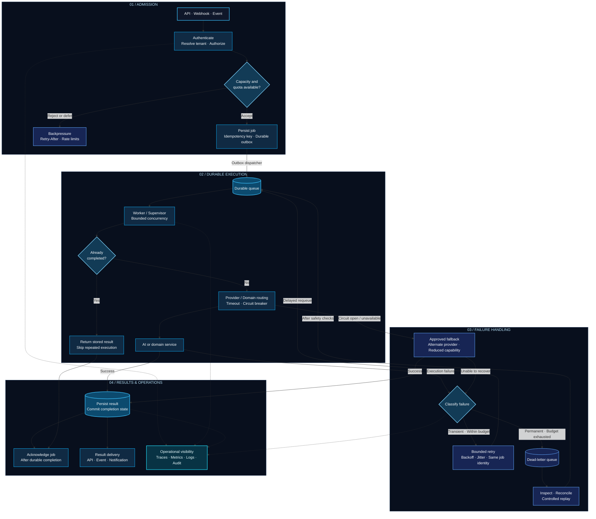

## Designed for execution. Engineered for recovery.

A reference architecture for how I approach asynchronous AI and business
workflows: explicit admission decisions, durable execution, bounded
concurrency, and recoverable failure paths.

**The engineering contract**

- **Admission is explicit:** Enforce tenant permissions, quotas, and capacity before accepting work.
- **Acceptance is durable:** Persist the job before reporting acceptance; dispatch through an outbox.
- **Retries preserve identity:** Use idempotency and reconciliation to handle duplicate delivery and ambiguous outcomes.
- **Execution is bounded:** Apply concurrency limits, deadlines, and retry budgets.
- **Completion survives failure:** Persist results before acknowledging the job.
- **Recovery is controlled:** Inspect failed work before replay; apply fallbacks only where domain rules permit.

> At-least-once delivery requires deliberate duplicate handling.
> External side effects need provider idempotency or reconciliation;
> a queue alone cannot guarantee exactly-once execution.
