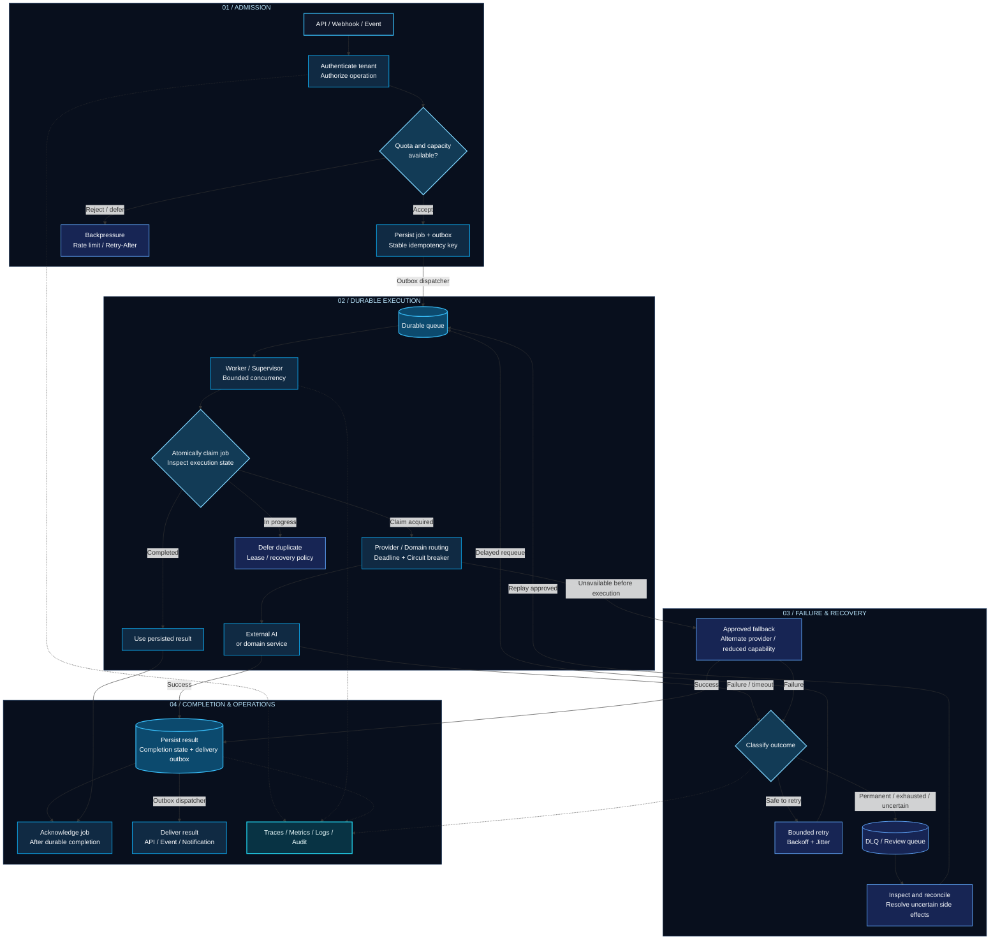

<a id="top"></a>

<div align="center">


# Architecture to production. Ownership through operations.

### CTO & AI Systems Architect · AIM Systems

**B2B SaaS · Real-Time AI & Voice · Distributed Systems · Platform Reliability**


[](https://aimsystem.in/)
[](https://aimstudio.co.in/)
[](https://theankitpanicker.web.app/)
[](https://www.linkedin.com/in/ankit-panicker/)
[](mailto:ankit@aimsystem.in)

[Profile](#profile) · [Engineering](#engineering) · [Architecture](#architecture) · [Technology](#technology) · [Selected Work](#work) · [Contact](#contact)

</div>

---

<a id="profile"></a>

## Product thinking. Systems depth. Delivery ownership.

I'm **Ankit Panicker**, CTO & AI Systems Architect at **AIM Systems**
and creator of **[APEX Connect](https://aimstudio.co.in/)**.

I build complete B2B products—from business requirements and architecture
through user experience, frontend applications, backend services, APIs,
AI integration, infrastructure, deployment, and ongoing operations.

My deepest engineering work sits in **Python backends, Redis coordination,
distributed workers, real-time voice orchestration, multi-tenant
architecture, and failure recovery**.

I connect technical decisions to the realities of operating a product:
latency, cost, security boundaries, deployment risk, recovery, and
maintainability.

> A feature includes its failure handling, observability, recovery,
> and the ability for another team to operate it.

<details>
<summary><b>⌨️ Open my developer profile</b></summary>

```typescript
const ankitPanicker = {
  role: "CTO & AI Systems Architect",
  company: "AIM Systems",
  creatorOf: "APEX Connect",

  focus: [
    "B2B SaaS and multi-tenant platforms",
    "Real-time AI and voice systems",
    "Distributed workers and reliable workflows",
    "Developer tools and operational platforms",
  ],

  ownership: [
    "Requirements",
    "Architecture",
    "Engineering",
    "Deployment",
    "Operations",
  ],

  principle: "Leave the customer with a system they can operate.",
};
```

</details>

<a id="engineering"></a>

## What I take ownership of

| Area | Engineering focus |
| :--- | :--- |
| **Product architecture** | Requirements, system boundaries, API contracts, and delivery trade-offs |
| **B2B SaaS** | Multi-tenancy, access control, business workflows, and operational interfaces |
| **Distributed execution** | Queues, workers, idempotency, durable outboxes, WAL, replay, and reconciliation |
| **AI and voice** | Real-time orchestration, streaming, provider routing, evaluations, and fallbacks |
| **Product engineering** | Frontend applications, backend services, integrations, SDKs, CLI tools, and MCP |
| **Platform reliability** | Bounded concurrency, backpressure, circuit breakers, and graceful degradation |
| **Operations** | Telemetry, incident diagnosis, deployment checks, rollback, and restore workflows |

<details>
<summary><b>Explore the full delivery lifecycle</b></summary>

```text
BUSINESS REQUIREMENTS
         |
         v
PRODUCT & SYSTEM ARCHITECTURE
         |
         +--- Experience
         |    Frontend / workflows / offline behaviour
         |
         +--- Interfaces
         |    APIs / SDKs / CLI / MCP
         |
         +--- Services
         |    Data / tenancy / permissions / orchestration
         |
         +--- AI runtime
         |    Models / streaming / evaluations / fallbacks
         |
         +--- Execution
         |    Queues / workers / concurrency / recovery
         |
         +--- Platform
              Containers / delivery / secrets / telemetry
         |
         v
DEPLOY ---> OBSERVE ---> OPERATE ---> IMPROVE
```

</details>

<a id="architecture"></a>

## Designed for execution. Engineered for recovery.


A reference architecture for asynchronous AI and business workflows:
explicit admission decisions, durable execution, bounded concurrency,
and recoverable failure paths.



<details>
<summary><b>The engineering contract behind the diagram</b></summary>

- **Admission is explicit:** Enforce tenant permissions, quotas, and capacity before accepting work.
- **Acceptance is durable:** Persist the job before reporting acceptance; dispatch through an outbox.
- **Execution has an owner:** Use atomic claims and a defined policy for expired leases and concurrent delivery.
- **Retries preserve identity:** Keep stable operation keys and distinguish safe retries from uncertain outcomes.
- **Work is bounded:** Apply concurrency limits, deadlines, and retry budgets.
- **Completion survives failure:** Persist results before acknowledging jobs.
- **Delivery is recoverable:** Use an outbox and idempotent consumers for downstream notifications or events.
- **Recovery is controlled:** Inspect failed work before replay and apply fallbacks only where domain rules permit.

At-least-once delivery requires deliberate duplicate handling.
External side effects need provider idempotency or reconciliation;
a queue alone cannot guarantee exactly-once execution.

This is a reference design. Implementation varies with the product,
its dependencies, and its operational requirements.

</details>

<a id="technology"></a>

## Engineering toolkit

### Core application and data technologies

<table>
<tr>
<td align="center" width="100">
<br /><sub><b>Python</b></sub>
</td>
<td align="center" width="100">
<br /><sub><b>FastAPI</b></sub>
</td>
<td align="center" width="100">
<br /><sub><b>Redis</b></sub>
</td>
<td align="center" width="100">
<br /><sub><b>TypeScript</b></sub>
</td>
<td align="center" width="100">
<br /><sub><b>React</b></sub>
</td>
</tr>
<tr>
<td align="center" width="100">
<br /><sub><b>Node.js</b></sub>
</td>
<td align="center" width="100">
<br /><sub><b>PostgreSQL</b></sub>
</td>
<td align="center" width="100">
<br /><sub><b>MySQL</b></sub>
</td>
<td align="center" width="100">
<br /><sub><b>Next.js</b></sub>
</td>
<td align="center" width="100">
<br /><sub><b>Tailwind CSS</b></sub>
</td>
</tr>
</table>

### Platform, delivery and observability

<table>
<tr>
<td align="center" width="100">
<br /><sub><b>Docker</b></sub>
</td>
<td align="center" width="100">
<br /><sub><b>GitHub Actions</b></sub>
</td>
<td align="center" width="100">
<br /><sub><b>Prometheus</b></sub>
</td>
<td align="center" width="100">
<br /><sub><b>Grafana</b></sub>
</td>
<td align="center" width="100">
<br /><sub><b>Nginx</b></sub>
</td>
</tr>
</table>

### Additional working toolkit

<table>
<tr>
<td align="center" width="100">
<br /><sub><b>Go</b></sub>
</td>
<td align="center" width="100">
<br /><sub><b>Kubernetes / AKS</b></sub>
</td>
<td align="center" width="100">
<br /><sub><b>Terraform</b></sub>
</td>
<td align="center" width="100">
<br /><sub><b>Azure</b></sub>
</td>
<td align="center" width="100">
<br /><sub><b>Cloudflare</b></sub>
</td>
</tr>
<tr>
<td align="center" width="100">
<br /><sub><b>PyTorch</b></sub>
</td>
<td align="center" width="100">
<br /><sub><b>Three.js</b></sub>
</td>
<td align="center" width="100">
<br /><sub><b>Vite</b></sub>
</td>
<td align="center" width="100">
<br /><sub><b>Firebase</b></sub>
</td>
<td align="center" width="100">
<br /><sub><b>Express</b></sub>
</td>
</tr>
</table>

**AI, interfaces and runtime**


### Depth of practice

- **Deep specialization:** Python, FastAPI, Redis primitives, queues/workers, reliability engineering, voice-AI orchestration, and multi-tenant backend architecture.
- **Strong functional experience:** TypeScript, React, Node.js/Express, SQL databases, Docker, CI/CD, observability, and frontend delivery.
- **Working/intermediate:** Go, Kubernetes/AKS, Terraform, advanced frontend graphics, and Cloudflare edge infrastructure.
- **AI focus:** Integration, inference, routing, evaluation, GPU lifecycle, and deterministic orchestration.

<details>
<summary><b>01 / Languages, backend and developer interfaces</b></summary>

- **Languages:** Python, TypeScript, JavaScript, Go, SQL, Bash, PowerShell, HTML, CSS.
- **Configuration:** HCL/Terraform, YAML, JSON, Asterisk dialplan, Nginx configuration.
- **Services:** FastAPI, Uvicorn, Pydantic, SQLAlchemy 2, Alembic, aiohttp, Node.js, Express, Hono.
- **Contracts:** REST APIs, OpenAPI, Zod, JSON Schema, AJV.
- **Real-time interfaces:** WebSockets, Socket.IO, Server-Sent Events, streaming and multipart uploads.
- **Developer products:** Go SDKs, CLI tools, MCP servers and tools.
- **Execution:** Redis-backed queues, workers, pub/sub, caching, rate limiting, and deterministic orchestration.

</details>

<details>
<summary><b>02 / Frontend, visualization and offline applications</b></summary>

- **Applications:** React, Next.js App Router, Vite, TypeScript, HTML, CSS, Tailwind CSS.
- **State and data:** Zustand, TanStack Query, TanStack Table, React Router.
- **UI:** shadcn/ui, Base UI, Lucide, Recharts, React Flow / XYFlow, Motion.
- **Graphics:** Three.js, React Three Fiber, Drei, OGL/WebGL.
- **Browser capabilities:** HLS.js, PWAs, service workers, Workbox, route-based code splitting.
- **Offline data:** IndexedDB, Dexie, DuckDB WASM, offline synchronization, privacy-first browser tools.

</details>

<details>
<summary><b>03 / AI integration, orchestration and evaluation</b></summary>

- **Providers:** OpenAI APIs, Azure OpenAI, Groq, Llama, Gemini.
- **Runtimes:** Hugging Face Transformers, local LLM endpoints, llama.cpp-style runtimes.
- **Orchestration:** Model/provider routing, structured-output validation, prompt/configuration versioning.
- **Retrieval:** RAG pipelines, vector memory, RedisVL.
- **Resilience:** Provider fallbacks, keyword fallbacks, partial-result degradation.
- **Runtime management:** Persistent workers, warm-model lifecycle, VRAM management, latency/concurrency/cost control.
- **Evaluation:** Golden datasets and AI behaviour evaluations.

</details>

<details>
<summary><b>04 / Real-time voice and telephony</b></summary>

- **Telephony:** Asterisk, PJSIP, SIP, RTP, AudioSocket, BSNL SIP trunks, Twilio, Telnyx.
- **Speech:** Deepgram, Whisper, Faster-Whisper, Azure Speech, Azure Neural TTS, Edge TTS, Kokoro, XTTS v2.
- **Streaming:** WebSocket audio, framing, pacing, silence keepalive, and audio quality gates.
- **Workflows:** Outbound campaigns, DID routing, call-state handling, CDRs, trunk-health gating.
- **Architecture:** Cloud control-plane/local media-plane separation and OpenVPN media connectivity.

</details>

<details>
<summary><b>05 / Data, coordination and recovery</b></summary>

- **Storage:** PostgreSQL, MySQL, Redis, Firestore, IndexedDB, Dexie, DuckDB WASM.
- **Data access:** SQLAlchemy, psycopg, mysql2, migrations, composite indexes, subcollections.
- **Governance:** Tenant isolation, soft deletes, optimistic concurrency, append-only audit records, tamper-evident chains.
- **Durability:** At-least-once delivery, idempotency, transactional/durable outboxes, WAL, replay, reconciliation.
- **Failure handling:** Retries, exponential backoff, dead-letter queues, circuit breakers.
- **Coordination:** Adaptive backpressure, bounded concurrency, graceful shutdown, in-flight draining, single-authority supervision, split-brain prevention.

</details>

<details>
<summary><b>06 / Cloud, infrastructure and deployment</b></summary>

- **Containers:** Docker, Compose, multi-stage builds, GPU containers.
- **Kubernetes/AKS:** Deployments, StatefulSets, HPA, KEDA, Pod Disruption Budgets, Ingress, ConfigMaps, Secrets.
- **Azure:** Container Registry, Key Vault, Virtual Networks, NSGs, Arc, Static Web Apps.
- **Infrastructure:** Terraform, External Secrets Operator, cert-manager.
- **Edge and hosting:** Nginx, Cloudflare Tunnel, Workers, Pages, Wrangler, Firebase Hosting.
- **Delivery:** GitHub Actions, OIDC-based CI/CD, build/artifact caching, deployment health checks.
- **Operations:** Rollbacks, backup/restore workflows, restore drills, hybrid cloud/edge deployments.

</details>

<details>
<summary><b>07 / Security, observability and quality engineering</b></summary>

- **Access:** Multi-tenant RBAC, permission matrices, JWT, OAuth2 with PKCE, API keys.
- **Controls:** bcrypt, rate limiting, CORS, Helmet, OS keychain storage, secret injection, Key Vault.
- **Security validation:** Tenant-isolation checks, SSRF/DNS-rebinding testing, credential and protected-path checks.
- **Governance:** Audit trails, AI transparency and human-review documentation, compliance-oriented architecture.
- **Telemetry:** OpenTelemetry, Prometheus, Grafana, Loki, Sentry, OTLP/gRPC, structured JSON logs, Pino.
- **Signals:** Queue depth, stage-level traces, latency, failure classification, synthetic probes, health/readiness endpoints.
- **Testing tools:** pytest, Vitest, Jest, Supertest, Playwright, k6, fast-check.
- **Validation:** Integration, E2E, load, stress, soak, chaos, failure injection, WebSocket/Redis faults, rolling deployments.
- **Operations:** Alerting, runbooks, incident diagnosis, rollback procedures, restore drills.

My strongest testing emphasis is failure-oriented infrastructure validation;
unit-test depth varies by project.

</details>

<details>
<summary><b>08 / Media pipelines, GPU inference and automation</b></summary>

- **Media:** FFmpeg, FFmpeg WASM, MoviePy, PyAV, OpenCV, Librosa.
- **Inference:** PyTorch, CUDA, Transformers, Diffusers, Accelerate, ONNX Runtime.
- **Runtime exposure:** SpeechBrain, Pyannote Audio, Segment Anything, MediaPipe, InsightFace, PEFT, GGUF.
- **Workflows:** GPU jobs, VRAM-aware lifecycle, low-VRAM inference, background removal, subtitles, forced alignment, ASS subtitles.
- **Interfaces:** Gradio, PyQt6.
- **Browser automation:** Playwright, Puppeteer, Cheerio, Beautiful Soup, Scrapling, Trafilatura, htmldate.
- **Extraction:** Persistent browser sessions, SPA rendering, retryable multi-source scraping.
- **Documents:** PDF parsing/generation, Mammoth, ExcelJS, SheetJS, OpenPyXL, WeasyPrint, Matplotlib, JSONPath.

</details>

<details>
<summary><b>09 / Search, discovery and growth tooling</b></summary>

- **Technical SEO:** Schema.org/JSON-LD, sitemaps, hreflang, Core Web Vitals.
- **Tools:** Search Console, GA4, PageSpeed Insights, CrUX, Lighthouse.
- **Research:** Keyword clustering, competitor analysis, backlinks, content briefs, E-E-A-T assessment.
- **Specializations:** Local, international, e-commerce, and programmatic SEO.
- **AI discovery:** GEO, AI citation readiness, search-experience analysis.
- **Monitoring:** SEO drift, Bing visibility, IndexNow, evidence-backed recommendations.

</details>

<a id="work"></a>

## Selected work

**`CLICK ANY VISUAL TO EXPLORE`**

<table>
<tr>
<td width="50%" valign="top">
<a href="https://aimstudio.co.in/">

</a>
<p><strong>Multi-tenant AI voice &amp; WhatsApp platform</strong></p>
<p>Real-time voice orchestration, appointment workflows, campaign execution, and control-plane/media-plane separation.</p>
<p><code>Voice AI</code> <code>Multi-tenancy</code> <code>Orchestration</code></p>
<p><a href="https://aimstudio.co.in/">Visit product website →</a></p>
</td>
<td width="50%" valign="top">
<a href="https://github.com/mrankitpanicker/apex-ai-shortz">

</a>
<p><strong>Local AI video generation</strong></p>
<p>FastAPI API, Redis-backed jobs, GPU workers, and an XTTS, Whisper, and FFmpeg media pipeline.</p>
<p><code>Python</code> <code>Redis</code> <code>GPU Workers</code></p>
<p><a href="https://github.com/mrankitpanicker/apex-ai-shortz">Explore repository →</a></p>
</td>
</tr>
<tr>
<td width="50%" valign="top">
<a href="https://github.com/mrankitpanicker/claude4saas">

</a>
<p><strong>Claude Code plugin marketplace &amp; agent harness</strong></p>
<p>Plugin package and documentation covering pipeline agents, execution guards, evaluations, and project bootstrap.</p>
<p><code>Agents</code> <code>Developer Tools</code> <code>Evaluations</code></p>
<p><a href="https://github.com/mrankitpanicker/claude4saas">Explore repository →</a></p>
</td>
<td width="50%" valign="top">
<a href="https://github.com/mrankitpanicker/aimsystems">

</a>
<p><strong>Public website &amp; application surface</strong></p>
<p>Public pages, Firebase configuration and rules, and a Cloudflare Worker for CV uploads.</p>
<p><code>Web</code> <code>Firebase</code> <code>Cloudflare</code></p>
<p><a href="https://github.com/mrankitpanicker/aimsystems">Explore repository →</a></p>
</td>
</tr>
</table>

<details>
<summary><b>Repository scope and supporting material</b></summary>

- **APEX AI Shortz** also includes a desktop interface, Docker configuration, monitoring components, tests, and documentation.
- **claude4saas** documents memory handling, effort routing, agent loops, statistics, installation, and troubleshooting.
- **AIM Systems Web** represents the public web surface; the underlying AI platform is outside that repository.
- Broader project context is available through my [portfolio](https://theankitpanicker.web.app/).

</details>

## Operating principles

| Principle | Engineering consequence |
| :--- | :--- |
| **Start with the business constraint** | Make cost, latency, scope, and operational trade-offs explicit |
| **Make boundaries enforceable** | Treat tenant isolation, permissions, and API contracts as system behaviour |
| **Assume dependencies will fail** | Define timeouts, retries, fallbacks, circuit breakers, and degraded modes |
| **Make repeated work safe** | Design for duplicate delivery, idempotency, replay, and reconciliation |
| **Observe the actual workflow** | Trace stages, queue depth, latency, failures, and recovery |
| **Design the handover** | Include deployment procedures, runbooks, rollback, and restore workflows |

<details>
<summary><b>The questions behind my architecture reviews</b></summary>

```text
[01] What is the failure domain?
[02] Which component owns the authoritative state?
[03] What happens when this operation runs twice?
[04] Where is the tenant boundary enforced?
[05] What happens when a model or provider is unavailable?
[06] How do we bound concurrency, latency, and cost?
[07] What evidence will explain a failure?
[08] How do we roll back, replay, restore, or reconcile?
[09] Can another team operate this after handover?
```

</details>

## GitHub activity

<details>
<summary><b>View contribution activity and repository statistics</b></summary>

[](https://github.com/mrankitpanicker)

[](https://github.com/mrankitpanicker)

[View my GitHub profile and native contribution history →](https://github.com/mrankitpanicker)

</details>

<a id="contact"></a>

## Build the product. Plan for its operation.

Available for **remote B2B product engineering and technical leadership
engagements with UK and European teams**.

- **Product architecture and delivery:** Requirements through deployed applications.
- **AI and voice systems:** Streaming workflows, integrations, orchestration, and evaluation.
- **Platform reliability:** Distributed workers, recovery paths, observability, and operational tooling.
- **Technical leadership:** Architecture decisions, engineering trade-offs, and maintainable delivery.

[](mailto:ankit@aimsystem.in)
[](https://www.linkedin.com/in/ankit-panicker/)

**[AIM Systems](https://aimsystem.in/)** ·
**[APEX Connect](https://aimstudio.co.in/)** ·
**[Portfolio](https://theankitpanicker.web.app/)** ·
**[GitHub](https://github.com/mrankitpanicker)**

---

<div align="center">

**ANKIT PANICKER**

*Architecture to production. Ownership through operations.*

[↑ Back to top](#top)


</div>
